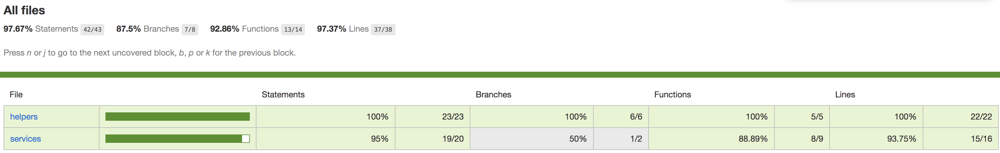

<h1 align="center">
  <br>
  
  <br>
  Mercado Livre
  <br>
</h1>

<p style="width:60%; text-align: center; margin: 0 auto 10px;">
This project is aimed to show my various degree of skills in the technologies required for solving the frontend code challenge at ML.
</p>
<div align="center" style="font-size:.8em">
  <!-- Stability -->
  <span style="background-color:#555; color: #fff; padding: 2px 0px 2px 5px; margin: 0 5px;">
    stability
    <span style="background-color: #EE8349; padding: 2px 4px;">
      experimental
    </span>
  </span>
  <!-- NPM version -->
  <span style="background-color:#555; color: #fff; padding: 2px 0px 2px 5px; margin: 0 5px;">
    npm
    <span style="background-color: #357DC0; padding: 2px 4px;"> 
      v6.5.0
    </span>
  </span>
  <!-- Test Coverage -->
  <span style="background-color:#555; color: #fff; padding: 2px 0px 2px 5px; margin: 0 5px;">
    API coverage
    <span style="background-color: #999; padding: 2px 4px;"> 
      97%
    </span>
  </span>
</div>

## Table of Contents
- [Installing](#installing)
- Running
-- [API](#running)
-- [Interface](#running)
- Tests
-- [unit tests](#unit-tests)
-- [integration tests](#integration-tests)
-- [E2E tests](#e2e-tests)
- [Installing](#installing)


## Getting Started

These instructions will get you a copy of the project up and running on your local machine for development and testing purposes. See deployment for notes on how to deploy the project on a live system.

### Installing
To clone and run this application, you'll need Git and Node.js (which comes with npm) installed on your computer. From your command line:

```
# clone this repository:
$ git clone https://github.com/MarioRinaldi/teste-mercado-livre.git

# Go into the repository
$ cd teste-mercado-livre

# Install dependencies
$ npm install

# Run the app
$ npm start
```

## Running


To start API standalone:
```
$ npm run api
```

To start interface standalone:
```
$ npm run interface
```

You can start api and interface concurrently:
```
$ npm start
```

## Tests

<a id="unit-tests" style="color: inherit;">Unit Tests:</a>
```
npm run unit:api
```

<a id="unit-tests" style="color: inherit;">Integration Tests:</a>
```
npm run integration:api
```

<a id="unit-tests" style="color: inherit;">E2E Tests:</a>
```
npm run e2e
```


## Coverage

API has 97% code coverage (helpers and services).
```
npm run coverage:api
```


## API Documentation


GET /api/items 

params:
- q = the word for product search
- limit = to limit the products

example of return:
```json
{
    "author": {
        "name": "Mario",
        "lastname": "Rinaldi"
    },
    "categories": [
        "Electrónica, Audio y Video",
        "Audio",
        "Audio Portátil  y Radios",
        "iPod"
    ],
    "items": [
        {
            "id": "MLA747981872",
            "title": "Apple Ipod Touch 32gb 6ta Gen Nuevos Gtia Escrita",
            "price": {
                "currency": "ARS",
                "amount": 149,
                "decimals": 99
            },
            "picture": "http://mla-s1-p.mlstatic.com/843653-MLA28149398126_092018-I.jpg",
            "condition": "new",
            "free_shipping": true,
            "city": "Tribunales"
        }
    ]
}
```

GET /api/items/:id
```json
{
    "author": {
        "name": "Mario",
        "lastname": "Rinaldi"
    },
    "categories": [
        "Autos, Motos y Otros",
        "Autos y Camionetas",
        "BMW",
        "Serie 3"
    ],
    "item": {
        "id": "MLA754502455",
        "title": "Bmw Serie 3 325i Coupe Sport M Hermosa, Impecable!!!!!",
        "price": {
            "currency": "ARS",
            "amount": 4999,
            "decimals": 0
        },
        "picture": "http://mla-s2-p.mlstatic.com/826609-MLA28203443896_092018-O.jpg",
        "condition": "used",
        "free_shipping": false,
        "sold_quantity": 0,
        "description": "VENDO BMW SERIE 3 325I COUPE SPORT M STEPTRONIC HERMOSA,IMPECABLE!!!!!\r\nel vehiculo se encuentra en excelente estado \r\nsin detalles ,impecable ,hermosa,digna de ver!!!! \r\ninterior en optimas condiciones \r\nsin nada roto ni mal tratado \r\nmuy lindo auto!!!!\r\nmuy buen funcionamiento !!!!\r\ncubiertas en muy buen estado \r\nmecanica en inmejorable estado \r\ntodos sus services hechos en tiempo y forma \r\npapeles listos para su transferencia \r\nse obliga a transferir si o si sin excepcion alguna \r\nel precio establecido de $ 499.900 es de contado \r\nno asi en permuta \r\nse toman vehiculos de mayor o menor valor solo de mi interes \r\nFINANCIACION \r\n60% en efectivo \r\nresto 12,18,24,30,36,48 cuotas a convenir \r\nsolo con dni,recibo de sueldo,sin estar en veraz \r\n30% de interes anual \r\nDIRECCION \r\nsarmiento 4165 caseros a 8 cuadras de acceso oeste y av.republica \r\nHORARIOS \r\nlunes a viernes de 11:30 a 19 hs y sabados de 11:30 a 16 hs \r\nTELEFONOS \r\n hernan 1152403414 wsp \r\njuan 1162142080 wsp \r\nmarcos 1164778830 wsp \r\nno se atienden llamadas privadas ni desconocidas \r\nse contestan wsp a la brevedad"
    }
}
```


## Built With

- express
- axios
- reactJS
- redux
- webpack
- SASS


## Versioning

We use [SemVer](http://semver.org/) for versioning. For the versions available, see the [tags on this repository](https://github.com/MarioRinaldi/teste-mercado-livre/tags). 

## Authors

* **Mario Felipe Rinaldi** - [MarioRinaldi](https://github.com/MarioRinaldi)

